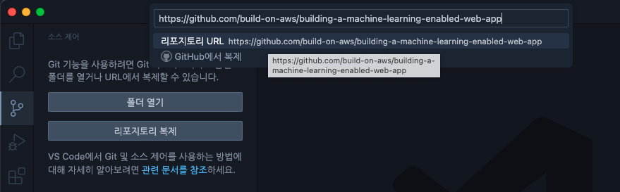
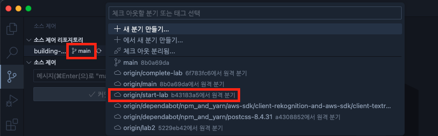
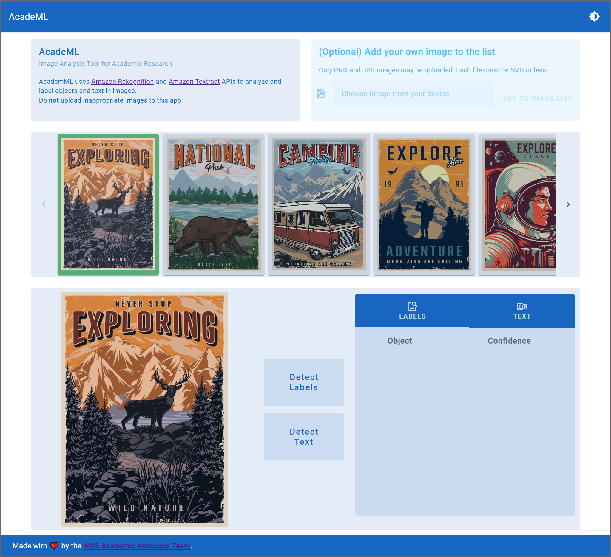
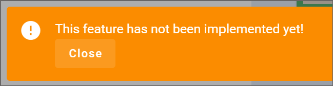

# LAB 1 : 기존 웹앱에 Amazon Rekognition 추가하기

AcadeML Research Tool은 이제 우리나라 모든 대학교에 배포할 준비가 거의 되어 있습니다.

연구원들과 학생들은 AcadeML을 사용하기를 계속 기다리고 있죠.

그러나, 아직 더 구현해야할 몇 가지 기능들이 여전히 남아있습니다.

1. Object Detection (객체 탐지)
2. Labeling in Images (이미지 레이블링)

우리는 위의 2가지 기능을 구현하기 위해 아래와 같은 요구사항을 따라줘야 합니다.

- 대학은 AWS 계정을 가지고, AcadeML 앱은 Amazon Machine Learning Services를 사용할 것이다.
- 먼저 추가되어야 하는 서비스는 Amazon Rekognition이다.
- AcadeML 인터페이스는 다른 팀원에 의해 개발되었고, 우리는 이 인터페이스를 수정할 수 없다.
- IAM 계정의 세부적인 정보들은 우리에게 주어질 것이다.

이 실습은 우리에게 단계별 과정을 제시해줍니다.

1. Github에서 기존 AcadeML 웹앱을 clone
2. Dependencies 설치 후 앱 실행
3. 브라우저에서 앱 테스트
4. 정확히 어떤 코드에서 API를 호출해야하는 것인지 알아내기
5. AWS IAM 환경변수 추가
6. Amazon Rekognition 호출 코드 작성
7. Amazon Rekognition을 통해 나오는 결과들 확인 후, 서비스들의 현재 가능한 기능들과 한계를 이해하기
8. AcadeML에서 새로운 기능 테스트해보기

## 1. AcadeML 레포지토리 Clone하기

설정하기에 따라 이 과정을 VS Code 안에서 완료할 수도 있고, 터미널 안에서 명령어를 통해 완료할 수도 있습니다.
아래 내용은 VS Code에서의 과정을 기재하였지만, 꼭 VS Code에서 해야 할 필요는 없습니다.
편하신 방법을 이용하면 됩니다 :)

1.  VS Code 실행 후 좌측 사이드바에서 Source Control 아이콘을 클릭합니다. 이 Source Control이 VS Code 안에서 레포지토리를 클론할 수 있게 해줍니다.
2.  Clone Repository 버튼을 클릭합니다. 이 버튼은 Command Palette를 열어 해당 Repository의 URL을 입력하도록 합니다.
3.  `https://github.com/build-on-aws/building-a-machine-learning-enabled-web-app`을 입력합니다.
    
4.  클론한 레포지토리가 저장될 폴더를 선택합니다. 이 폴더가 프로젝트 폴더가 됩니다.
    1. 클론할 때 VS Code는 `building-a-machine-learning-enabled-web-app`이라는 폴더를 생성합니다. 이 폴더 안에 클론한 앱 파일들이 들어있습니다.
    2. 몇몇 워크샵 참가자들 중 클라우드 동기화 폴더(ex. DropBox, OneDrive, iCloud...) 안에 저장하신 분들은 문제가 생길 가능성이 있으니, 가급적 **로컬 폴더**를 선택해주세요.
5.  클론이 완료되었다면, VS Code가 `Would you like to open the clones repository?`라고 물어봅니다. 이것에 따라 새로운 프로젝트 폴더를 열어주세요.
    1. `Do you trust the authors of the files in this folder?`라고 묻는 다면 `Yes, I trust the authors`를 선택해주세요.
6.  이제, 알맞은 브랜치로 들어가 봅시다. VS Code 좌측 사이드바의 Source Control 버튼을 누르고, `main` or `mainline` 브랜치 이름을 클릭해주세요.
    1. 클릭하면 명령 팔레트에서 해당 레포의 브랜치 목록들을 볼 수 있습니다.
    2. `origin/start-lab` or `start-lab`을 선택해주세요. 이제 현재 브랜치가 `start-lab`으로 바뀐 것을 볼 수 있습니다.
       
7.  명령 팔레트에서 `Run Task`를 실행해 Dependencies들을 설치합니다. 명령 팔레트를 시작하기 위해선, F1 키나 CTRL+SHIFT+P (mac은 CMD+SHIFT+P)를 눌러줍니다. 팔레트에서 `Tasks: Run Task`를 입력 후 Enter키를 눌러주세요.
    1. 명령 팔레트는 `run tasks`를 위한 도구들을 나열합니다. `npm`을 선택 후 `npm: install`을 선택해주세요.
8.  설치가 완료되었으면, 이제 처음으로 App을 실행해 볼 시간입니다! 1) `Run Task` -> `npm` -> `npm: dev`을 선택해주세요. 2) 만약 세부 옵션을 선택하는 창이 나온다면, 가장 위의 것을 선택해주세요. 3) 이것은 VS Code 내에서 새로운 터미널 프로세스를 실행시키고, 잠시 후 터미널에선 다음과 같은 메세지가 나타날 것입니다.
    ```bash
    VITE v3.2.7 ready in 530 ms

        ➜  Local:   http://localhost:3000/
        ➜  Network: use --host to expose
        ```

    App이 실행되는 것을 보기 위해선 웹 브라우저를 실행한 후 `http://localhost:3000/`에 접속해주세요.
    페이지가 성공적으로 렌더링되었다면, 사진을 클릭해 정상적으로 동작하는지 테스트해주세요.
    다음 세션에서는 App을 사용하는 방법을 알려드리지만, 현재는 우선 App을 중단해줍시다!

9.  `npm dev run`을 중지하기 위해선, 터미널 우측 상단에 위치한 쓰레기통 모양의 `Kill Terminal` 아이콘을 클릭해야 합니다.
10. Hot Reloading이 지원되기 때문에, 앱이 실행되는 동안 코드를 수정한다면 수정된 버전의 코드가 실시간으로 반영되는 것을 확인할 수 있습니다. (특정 상황에선 앱을 새로 실행해야합니다.)

다음 세션에서는 앱이 어떻게 동작하는지 배워봅시다.

## 2. AcadeML 애플리케이션 UI 살펴보기

App에 본격적인 ML 코드를 작성하기 전에, 우선 AcadeML App UI를 알아봅시다.

1. App 실행 중이 아니라면, VS Code 명령 팔레트에서 `Run Task:` -> `npm: dev`를 선택하여 App을 실행해주세요.
2. App을 브라우저에서 열어주세요 (http://localhost:3000/).
3. 정상적으로 실행된 페이지에선 다음 동작이 원활하게 작동해야 합니다.
   1. 여러 이미지들 중 아무 이미지를 클릭해보세요. 하단에 클릭한 이미지가 조회된다면 정상적인 동작입니다.
   2. \<, \> 버튼을 클릭해보며 수평 스크롤이 동작하는지 확인해보세요.
4. 여러분만의 이미지를 파일에서 불러와 등록해보세요 (`Choose image from your device` 클릭 후 불러오기). 그 다음 `ADD TO IMAGE LIST`를 선택해주세요.
   1. **주의**: PNG, JPG 이미지들만 업로드할 수 있습니다. 최대 이미지 크기는 5MB 입니다.
5. `Detect Labels`버튼을 통해 Object Labeling을 위한 사진 전송을 할 수 있습니다.
6. `Detect Text`버튼을 통해 Text Recognition을 위한 사진 전송을 할 수 있습니다.
7. `LABELS` or `TEXT` 버튼을 클릭하여 이미지 분석 후의 결과물을 확인해보세요.
   

위의 단계를 밟아오면서 각 기능들이 제대로 동작하는지 확인해보세요.
아직 Machine Learning 코드를 작성하여 배포하지 않았기 때문에, `Detect Labels`, `Detect Text` 버튼을 클릭하면 해당 기능들이 아직 구현되지 않았다는 경고창을 보게 됩니다.


이제 이 기능들을 구현해볼 시간입니다. VS Code로 돌아가시죠!

## 3. AcadeML Application 코드 살펴보기

프로젝트를 처음 봤을 땐 수많은 코드들로 이루어졌다는 생각이 들겠지만, 대부분의 코드는 여러분들이 신경쓰지 않아도 되는 코드입니다. 또한 여러분들은 변경해야만 하는 코드만 살펴보면 되기 때문에 겁먹지 않으셔도 됩니다!

우선, 아래 파일들은 프로젝트 설정이나 git 소스코드 설정과 관련된 내용이므로, 여러분들은 이 파일들을 무시하셔도 됩니다.

```
.browserslistrc
.gitignore
CODE_OF_CONDUCT.md
CONTRIBUTING.md
node_modules
package-lock.json
package.json
README.md
jsconfig.json
LICENSE
vite.config.js
src\plugins\index.js
src\plugins\vuetify.js
src\plugins\webfontloader.js
```

- `index.html` : 앱의 Index Page (앱에서 최초로 실행되는 페이지)
- `public\assets\` : 샘플 이미지 파일들
  - 만약 여러분들이 원하신다면, 이 샘플 이미지 파일들을 여러분들이 원하시는 사진들로 교체하셔도 무방합니다.
  - 하지만 적어도 한 장 이상의 이미지가 반드시 존재해야 합니다. 그리고 반드시 5MB 이내의 JPG, PNG 이미지여야 합니다.
- `public\assets\images.json` : App 페이지에 불러와지는 샘플 이미지들을 기재한 JSON 파일입니다. 만약 여러분들이 원하시는 사진들로 교체하셨다면, `images.json` 내의 "files" 내용들도 각 이미지들의 이름으로 교체해야 합니다.
- `src\main.js`, `src\App.vue`, `src\components\` : Vue3 파일들입니다. UI를 비롯하여 App의 상호작용 기능들을 담당하는 코드들이 포함되어 있습니다.
  ```
  src\main.js
  src\App.vue
  src\components\AddLocalImages.vue
  src\components\AppFooter.vue
  src\components\AppHeader.vue
  src\components\ImageAnalysis.vue
  src\components\ImageList.vue
  src\components\Instructions.vue
  ```

위 파일들은 `Vuetify` 컴포넌트들을 포함하고 있고, `Options` 대신 `Composition API`를 사용하고 있습니다.
즉, 코드를 살펴보면 `<script setup>` 블록 안에 파일 내의 모든 코드들이 포함된다는 것을 알 수 있고, UI 관련 코드는 `<template>` 블록 안에 작성된다는 것을 의미합니다. `ref`나 `reactive`에 의해 생성된 특정 변수들은 UI에서 해당 변수들로 접근할 수 있습니다.

예시로 들기 가장 좋은 파일은 `src\components\ImageAnalysis.vue` 파일입니다. 이 파일의 80번째 줄 근처에서는 `v-btn` 컴포넌트가 작성되어 있습니다. (해당 파일을 열어보세요.)

```jsx
<v-btn
   raised
   x-large
   variant="tonal"
   @click="onDetectLabelsClick"
   class="mb-2"
   style="font-size: 18px; text-transform: none"
   height="100px"
   :loading="apiDetectLabelsRequestInProgress"
   ...
>
```

주목해야 할 부분은 `@click="onDetectLabelsClick`입니다. 이 코드는 버튼이 클릭되었을 때 호출될 메서드를 명시합니다. 위쪽으로 스크롤하여 명시된 메서드가 정의된 부분을 확인해 봅시다.

```jsx
const onDetectLabelsClick = async () => {
  await analyzeImage("labels");
};
```

`onDetectLabelsClick` 메서드는 `analyzeImage("labels");`를 호출하고, `"labels"` 인자를 통해 메서드에게 우리가 분석하고 싶은 이미지를 전달합니다. <br>
이 메서드 안에서 호출되는 `analyzeImage` 메서드는 인자를 통해 전달받은 객체가 labels인지 요청받은 text인지를 결정한 후, `AmazonML.js`로 불리는 분리된 파일 안에 있는 메서드를 호출합니다.
App은 이러한 방식을 통해 여러분이 수정해야 할 코드를 단지 하나로 최소화하여 최적의 실습을 제공합니다.

아래에서 설명하는 2개의 파일들은 Vue3가 아닌 Javascript 파일들입니다.

- `src\ImageState.js` : 이미지 목록과 ML 메서드들의 결과물들, 그리고 현재 선택된 이미지를 저장합니다. 오직 2개의 상태값("labels" / "text")만 공유하는데 필요하기 때문에, 굳이 Vue3 State Library를 사용하는 것 보다 이렇게 구현하는 것이 훨씬 간단했습니다.
- `src\AmazonML.js` : 기타 코드들과 함께 **우리가 구현해야할 빈 메서드들이 포함되어 있습니다.** `base64ToUint8Array`라는 유용한 메서드도 있습니다. 이 메서드는 이미지 데이터를 Amazon ML API들이 요구하는 형식으로 포맷팅해주는 메서드지만, 아직 사용되지 않았습니다.

전반적인 코드들을 살펴봤으니, 이제는 구현해야 할 기능들에 대한 코드를 작성할 시간입니다. <br>
`src\AmazonML.js`를 제외한 모든 열린 파일들을 닫으셔도 좋습니다.

## 4. AcadeML에 Amazon Rekognition Client 추가하기

VS Code에서 `src\AmazonML.js` 파일을 열어주세요. <br>
초기 파일은 많은 내용이 담겨있지 않습니다. 단지 다른 개발자가 여러분들이 추가 기능들을 구현해주길 바라며 만든 코드들만 있습니다.

```jsx
import { Buffer } from "buffer";

export async function analyzeImageML(type, imageData) {
  const returnData = {
    type: "warning",
    text: "This feature has not been implemented yet!",
  };
  return JSON.stringify(returnData);
}

// imageData is string with data:application/octet-stream;base64,...
function base64ToUint8Array(base64Data) {
  const decoded = Buffer.from(base64Data, "base64");
  const bytes = new Uint8Array(
    decoded.buffer,
    decoded.byteOffset,
    decoded.byteLength
  );
  return bytes;
}
```

이 App은 Modular Client Architecture로 구성된 AWS SDK V3를 사용합니다. <br>
즉, 여러분들은 전체 SDK를 설치할 필요 없이 필요한 모듈들만 설치하면 된다는 것을 의미합니다.

여러분들의 App에서 AWS service에 접근할 필요가 있다면, 다음과 같은 절차를 밟으셔야 합니다.

1. 필요한 서비스들의 client library가 여러분의 프로젝트에 설치되어야 합니다.
2. 해당 클라이언트의 instance가 코드로 생성되고, AWS IAM 자격 증명 정보들이 클라이언트에 전달됩니다.
3. 만약 IAM 자격 증명 정보들이 정상적으로 인증된다면 클라이언트가 생성됩니다.
4. 클라이언트를 사용하기 위해선, 명령어를 통해 클라이언트에게 요청해야만 합니다.

각 단계들을 차례대로 진행해 봅시다.

## 5. SDK 모듈 설치 & IAM 자격 증명 추가하기

### Rekognition Client Library 설치

이 단계는 터미널 상에서 `npm install`을 실행했을 때 자동으로 진행됩니다. (이전 단계에서 완료했습니다.) <br>
만약 수동으로 해당 라이브러리만을 설치해야 한다면, `npm i @aws-sdk/client-rekognition`을 입력해보세요.

AWS SDK for JavaScript에 대한 자세한 정보는 깃허브에서 확인할 수 있습니다. ([링크](https://github.com/aws/aws-sdk-js-v3))

라이브러리가 설치되었으면, 해당 라이브러리를 `AmazonML.js` 파일에 import해야 합니다. <br>
`import { RekognitionClient } from "@aws-sdk/client-rekognition";` 코드를 파일 상단에 작성해 주세요.

```jsx
import { Buffer } from "buffer";
import { RekognitionClient } from "@aws-sdk/client-rekognition";

export async function analyzeImageML(type, imageData) {
  ...
```

### IAM 자격 증명 정보 생성하기

클라이언트를 만들기 위해서, 여러분들은 활성화된 AWS 계정이 필요합니다.

- 이번 행사에 참여하신 여러분들에게는 Access key와 비밀 키가 제공됩니다. (스태프에게 문의 바랍니다.)

Access key와 비밀 키를 획득했다면, 이 정보들을 프로젝트에 추가해야 합니다. <br>
이를 위해, 현재 프로젝트의 root 폴더에 `.env.local` 이라는 이름의 새 파일을 생성해 주세요. <br>
(root 폴더는 git clone을 통해 얻은 디렉토리의 최상단 경로를 의미합니다. src를 비롯한 다른 내부 폴더 안에 존재하지 않게 주의해주세요!)

주의 : **env.local 이름 앞에 .이 붙음을 유념해주세요! ('.'는 숨김 파일이라는 뜻입니다.)**

`.env.local` 파일 안에는 아래 내용을 입력해주세요.

```txt
VITE_AWS_ACCESS_KEY_ID=your access key
VITE_AWS_SECRET_ACCESS_KEY=your secret
VITE_AWS_SESSION_TOKEN=your session token
VITE_AWS_REGION=us-east-1
```

주의 : **이번 워크샵을 개인 계정으로 진행할 시, 추후엔 VITE_AWS_SESSION_TOKEN의 값이 만료되어 올바르게 동작하지 않음을 미리 알려드립니다.**

이제 비밀 정보들을 추가할 준비가 되었습니다.
`AmazonML.js` 파일에 `creds` 값들을 추가해주세요. 이 `const creds = {...}` 내용은 반드시 analyzeImageML 메서드보다 앞에 와야 함에 주의해주세요.

```jsx
import { Buffer } from "buffer";
import { RekognitionClient } from "@aws-sdk/client-rekognition";

const creds = {
  region: import.meta.env.VITE_AWS_REGION,
  credentials: {
    accessKeyId: import.meta.env.VITE_AWS_ACCESS_KEY_ID,
    secretAccessKey: import.meta.env.VITE_AWS_SECRET_ACCESS_KEY,
    sessionToken: import.meta.env.VITE_AWS_SESSION_TOKEN, // leave out if not in hosted workshop
  },
};

export async function analyzeImageML(type, imageData) {
```

`creds` 변수 내부를 보면 `.env.local`에 기재된 기밀 정보들을 변수화하여 사용하고 있음을 알 수 있습니다.

현재까지 진행된 코드 전체를 정리하자면 아래와 같습니다.

```jsx
import { Buffer } from "buffer";
import { RekognitionClient } from "@aws-sdk/client-rekognition";

const creds = {
  region: import.meta.env.VITE_AWS_REGION,
  credentials: {
    accessKeyId: import.meta.env.VITE_AWS_ACCESS_KEY_ID,
    secretAccessKey: import.meta.env.VITE_AWS_SECRET_ACCESS_KEY,
    sessionToken: import.meta.env.VITE_AWS_SESSION_TOKEN, // leave out if not in hosted workshop
  },
};

export async function analyzeImageML(type, imageData) {
  const returnData = {
    type: "warning",
    text: "This feature has not been implemented yet!",
  };
  return JSON.stringify(returnData);
}

// imageData is string with data:application/octet-stream;base64,...
function base64ToUint8Array(base64Data) {
  const decoded = Buffer.from(base64Data, "base64");
  const bytes = new Uint8Array(
    decoded.buffer,
    decoded.byteOffset,
    decoded.byteLength
  );
  return bytes;
}
```

자, 이제 클라이언트를 생성하는 코드를 추가해 봅시다.

## 6. Rekognition Client 초기화 및 설정 코드 추가하기

#### Rekognition Client 코드 추가하기

이제, `analyzeImageML` 메서드를 수정함으로써 Rekognition Client를 추가하는 과정을 진행해봅시다. 우선, RekognitionClient 객체를 생성해야 합니다. 생성 시 인자에 `creds` 값을 넣어줌으로써 올바른 사용자임을 알려주세요.
또한, 예외 처리를 위해 `try ... catch` 문을 사용하고, `let rekognitionClient = null;`을 메서드 외부에 선언함으로써 객체를 저장할 변수를 만들어줍니다.

위의 내용을 포함하여 수정된 `analyzeImageML`은 아래와 같습니다.

```jsx
let rekognitionClient = null;
export async function analyzeImageML(type, imageData) {
  let returnData = null;
  try {
    if (type == "labels") {
      // If the client has not been initialized yet, create it
      if (!rekognitionClient) rekognitionClient = new RekognitionClient(creds); // pass in the creds as parameter
      returnData = {
        // This is for test purposes, it will show a message that the client was created
        type: "info",
        text: "Rekognition Client Created",
      };
    }
  } catch (error) {
    returnData = {
      type: "error" /* success info warning error */,
      text: error.message,
    };
  }
  return JSON.stringify(returnData);
}
```

\*\* 참고 : 여러분들은 `Run Task: npm: dev`를 통해 과정들을 테스트할 수 있으며, Detect Labels 버튼을 클릭했을 시 `the client was created`라는 메세지 팝업 창이 표시되면 성공입니다.

## 7. DetectLabels 명령 추가 및 호출하기

#### DetectLabels 추가하기

Rekognition Client가 실제로 유용하게 쓰이기 위해선, 여러분들은 이 클라이언트에 명령을 내려야 합니다.<br>

1. 클라이언트를 만들어 내는 명령 import <br>
   : 다음과 같이 library 메서드들을 추가해주세요.

```jsx
import { Buffer } from "buffer";

// 아래 코드에 추가할 메서드들을 작성해주세요
import { RekognitionClient, DetectLabelsCommand } from "@aws-sdk/client-rekognition";

const creds = {
  ...

```

2.
